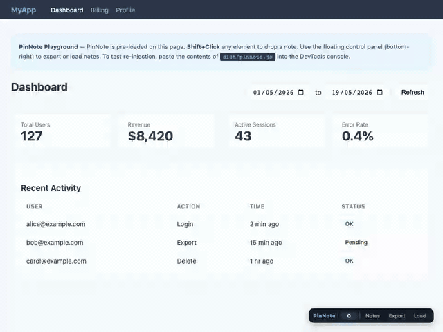

# PinNote

Drop notes on any live web page, then hand them to an AI agent to act on.

Shift+Click any element to pin a note to it. When you're done, export a `notes.md` file. Give that file to your AI coding agent. It reads the notes, applies changes, and writes status back. Load the updated file to see what was done.



The GIF shows the full round-trip: annotate two elements, export `notes.md`, an agent writes back statuses, then Load to see pins turn green (applied) and yellow (needs-clarification).

## Why PinNote

- **The export is a two-way artifact.** Most annotation tools are one-way: you leave notes, a human reads them. PinNote's `notes.md` goes to an AI agent, the agent writes status and responses back into the same file, and you load it to see what happened. The file is the conversation.
- **The file ships its own instructions.** A meta-prompt embedded in the frontmatter tells any compliant agent exactly how to process the notes — tag semantics, status transitions, the "ask, don't guess" rule. You don't have to explain the format.
- **Anchors are agent-consumable.** Each note carries a CSS selector, text snippet, and viewport coordinates with a confidence level. An agent can locate the element in the codebase, not just look at a screenshot.
- **No backend, no account, no data leaves your browser.** Storage is localStorage or a user-granted folder via the File System Access API. Nothing is uploaded anywhere.
- **Zero-install option.** The DevTools snippet works on any browser, any page (including `chrome://`), no extension install. Lower friction than any hosted tool.
- **Human-in-the-loop by design.** The agent can't delete your notes or guess your intent. If something is unclear, it sets `needs-clarification` and asks. You stay in control.

## Delivery methods

PinNote ships two ways: as a **DevTools snippet** (works everywhere, no install) and as a **Chrome extension** (toolbar toggle, persistent across refreshes, error capture).

---

## Method 1 — DevTools snippet (any browser)

Works on any page, including `chrome://` and `about:`. No installation needed, but DevTools must be open.

### Build

```bash
npm install && npm run build
```

Produces `dist/pinnote.js` — a single self-contained script you inject into any page.

### Quickstart

Open `examples/playground.html` in your browser. PinNote loads automatically. Shift+Click any element to try it.

### One-time setup per Chrome profile

1. Open DevTools (F12) → Sources → Snippets
2. Click "New snippet", paste the full contents of `dist/pinnote.js`, name it `pinnote`
3. The snippet is saved to your profile permanently

### Usage

1. Open DevTools on the page you want to review
2. Sources → Snippets → right-click `pinnote` → Run (or Cmd+Enter)
3. Shift+Click any element to drop a note
4. Click **Export** (bottom-right control bar) to download `notes.md`

### Loading agent responses

1. After your agent updates `notes.md` with statuses and responses, click **Load**
2. Pins update: green = applied, yellow = needs clarification, gray = skipped

---

## Method 2 — Chrome extension

Toolbar icon toggle, notes persist across page refreshes, automatic error capture. Requires Chrome.

### Build

```bash
npm install && npm run build
```

Produces `dist/pinnote.js` (for the snippet method) and `extension/pinnote.js` + `extension/errors.js` (for the extension).

### Install

1. Open `chrome://extensions`
2. Enable **Developer mode** (top-right)
3. Click **Load unpacked** and select the `extension/` folder
4. Click the puzzle-piece extensions menu in the toolbar, find PinNote, and click the pin icon so it stays visible
5. The extension will warn about "Read and change all your data" -- that is required because PinNote must work on any page you're reviewing. No data is sent anywhere.

### Usage

1. Go to a page you want to review
2. Click the PinNote toolbar icon to activate
3. Shift+Click any element to drop a note
4. Click the icon again to deactivate
5. Click **Export** (bottom-right) to download `notes.md`

The badge on the icon shows your note count. PinNote stays active across SPA route changes; after a full page reload, click the icon again.

### Error capture

JavaScript errors and unhandled promise rejections are captured as notes with the "error" tag, including stack trace, source URL, and timestamp. The capture hooks run at document start, before any page scripts.

### Loading agent responses

Same as the snippet method: click **Load** in the control bar after the agent writes back to `notes.md`.

## Tags

| Key | Tag | Meaning |
|-----|-----|---------|
| ⌥1 / Alt+1 | `change` | This needs to be different |
| ⌥2 / Alt+2 | `remove` | Delete this |
| ⌥3 / Alt+3 | `add` | Something is missing here |
| ⌥4 / Alt+4 | `unclear` | Confusing — needs clarification (default) |

## Keyboard shortcuts

| Shortcut | Action |
|----------|--------|
| Shift+Click | Drop a note on an element |
| ⌥1–4 / Alt+1–4 | Change tag while writing a note |
| Enter | Save note |
| Shift+Enter | Newline in note text |
| Esc | Cancel / close |

## The workflow

1. **Annotate** — Shift+Click elements, write notes
2. **Export** — Download `notes.md`
3. **Agent** — Give the file to your AI agent. The embedded prompt in the file tells it exactly how to process notes and write back statuses
4. **Load** — Agent updates `notes.md`; load it back to see results
5. **Repeat** — Clarify, add new notes, re-export

